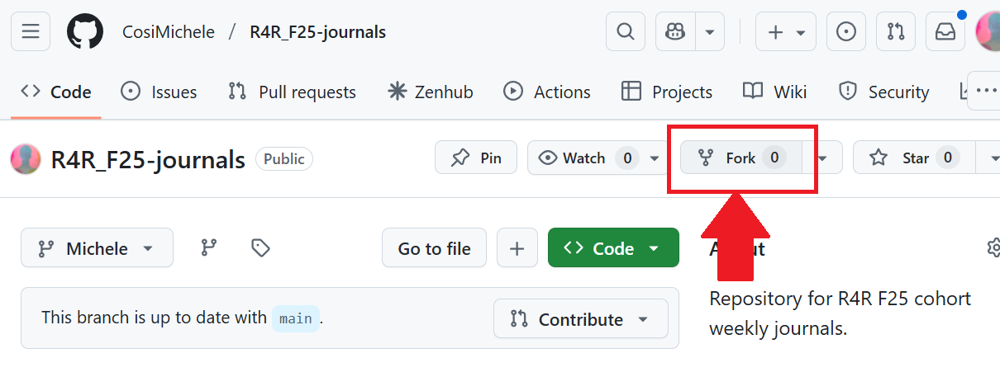
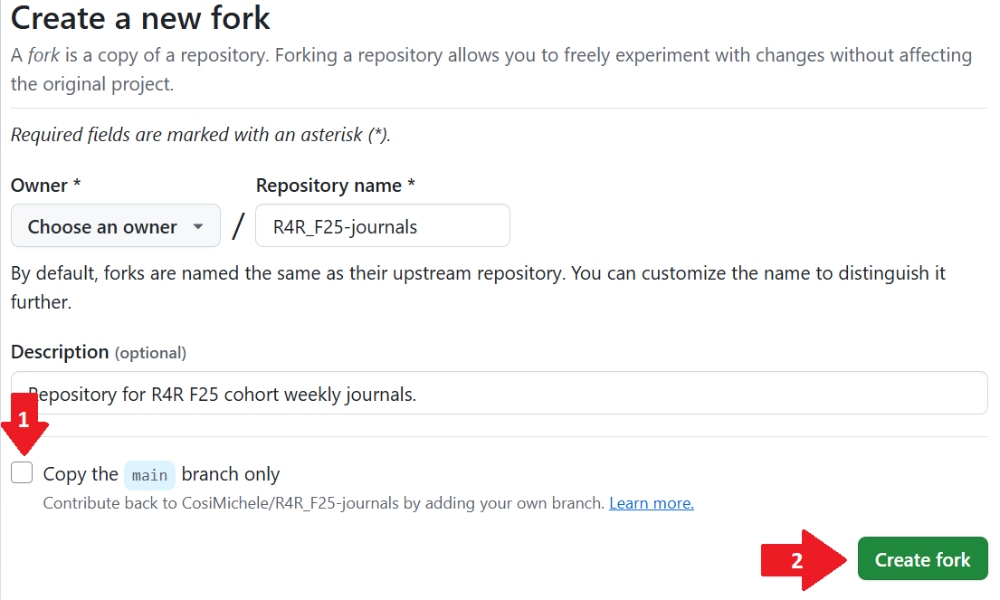

# Roots 4 Resilience 2025 Fall Journals

Repository for R4R F25 cohort weekly journals.

## Entries Overview

Journals are an essential part to learning, applying and reporting your progress through Roots 4 Resilience and [FOSS](https://foss.cyverse.org/).

Each journal has 3 parts:

| Name of Entry | Entry Type | Due Date of Entry |
|---|---|---|
| Rose, Thorn, Bud | - Write what worked/**what is applicable to your research** during the FOSS session (Rose);   - What you didn't understand as well/**what you think would be challenging to apply to your research** (Thorn)   - **What could potentially be applied to your work?** (Bud) | Due immediate Wednesday following FOSS, 11pm |
| Research Application | Following up the R4R Thursday discussion, write how the weekly covered material is applicable/not applicable to your work. If applicable, give clear examples of the application; If not, describe in detail why not. | Due prior to following FOSS session |
| Cohort meetup discussion | Give a summary of the discussed topics that are relevant to your work. | Due prior to following R4R session |

## Submission Instructions

Submissions are carried out in 2 steps:
1. Forking the repository (**one time** step!)
2. Pull requests (done each time you want to make a submission)

[**Forking**](https://docs.github.com/en/pull-requests/collaborating-with-pull-requests/working-with-forks/fork-a-repo) is the action of copying a repository AND keeping it connected to the source (copying but severing the connection is called [**Importing**](https://docs.github.com/en/migrations/importing-source-code/using-github-importer/importing-a-repository-with-github-importer)).

This allows to create your own copy of the journaling repository. You can make changes to the [**Branch**](https://docs.github.com/en/pull-requests/collaborating-with-pull-requests/proposing-changes-to-your-work-with-pull-requests/about-branches) of the copied repository without altering the source. 

Once you are satisfied of your changes, you can then create a [**Pull Request**](https://docs.github.com/en/pull-requests/collaborating-with-pull-requests/proposing-changes-to-your-work-with-pull-requests/about-pull-requests) in order to submit your weekly journals.

### Forking

The following steps have to be executed **once**.

1. Fork the original repository (this repository): at the top of the page, find the **Fork** button. 

    

2. In the **Creat a Fork** page, ensure that (1) "Copy the `main` brach only" is ticked off and then (2) click the **Create fork** button.

    

### Pull Requests